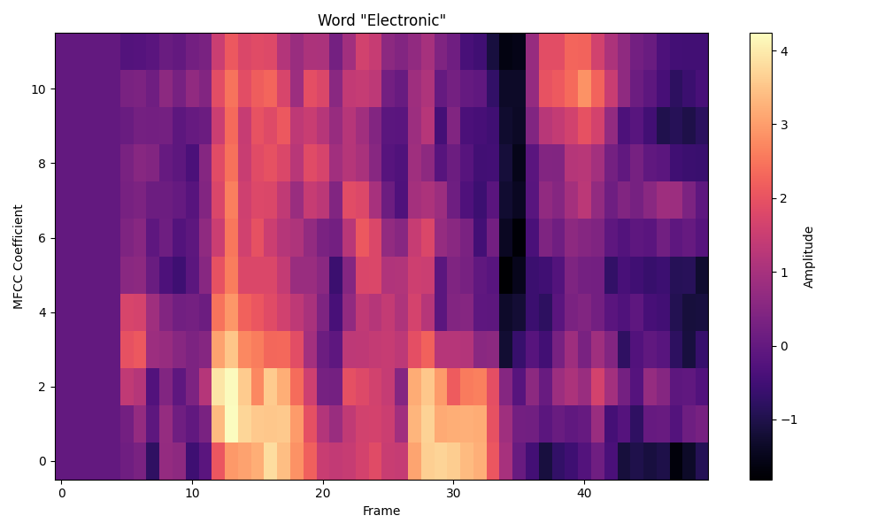
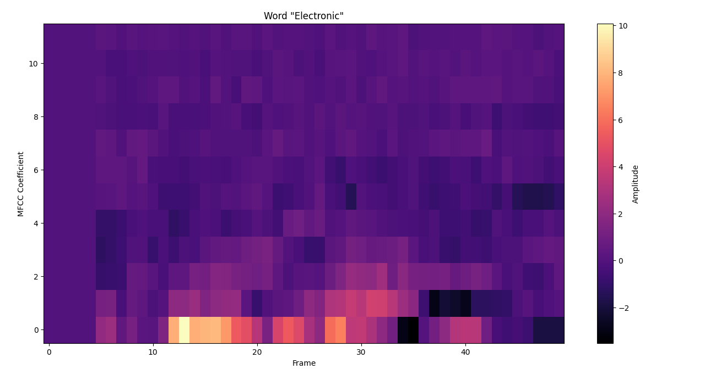
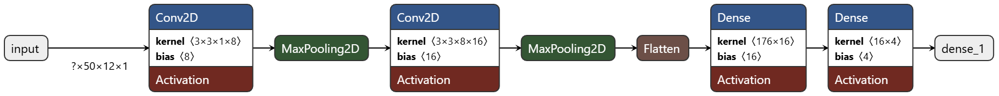

<!-- PROJECT LOGO -->
 

  <h3 align="center">Neural Speech</h3>

  

    Voice recognition on Arduino Due for school project at ECE Paris

## Audio Processing Pipeline

The audio signal undergoes the following processing steps:

1. **Sampling & Filtering**  
   - Sampled at **32 kHz**
   - Band-pass FIR filter (300–3400 Hz), stop bands at 0–300 Hz and 4000–16000 Hz

  

    
    
<strong>RIF Used</strong>

  

2. **Downsampling**  
   - Downsampled to **8 kHz** for reduced computation

3. **Framing & Overlap**  
   - Frame size: **256 samples**
   - Overlap: **37.5%** (96 samples)

4. **Preprocessing**  
   - **AGC (Automatic Gain Control)**
   - **FFT** to convert to frequency domain

5. **Mel Filterbank & MFCC Extraction**  
   - Apply **Mel filters**, **log compression**, then **DCT**
   - Extract **12 MFCCs per frame**

  

    

      
      
<strong>Mel Filter Application</strong>

    

    

      
      
<strong>DCT Matrix Application</strong>

    

  

6. **Temporal Context**  
   - Repeat for **50 frames** = **1 second of audio**
   - Result: matrix of shape **[50 × 12]**

## Deep Learning for Classification

After computing the MFCC matrix (12 coefficients across 50 frames, representing 1 second of audio), the features were passed into a lightweight Convolutional Neural Network (CNN) for classification.

**Model architecture:**
- **Input:** MFCC matrix shaped `(50, 12, 1)`
- **First Convolutional Block:**
  - `Conv2D`: 8 filters, kernel size `(3x3)`, activation `ReLU`
  - `MaxPooling2D`: pool size `(2x2)`
- **Second Convolutional Block:**
  - `Conv2D`: 8 filters, kernel size `(3x3)`, activation `ReLU`
  - `MaxPooling2D`: pool size `(2x2)`
- **Fully Connected Layers:**
  - `Flatten`
  - `Dense` layer with 8 units, activation `ReLU`
  - `Dense` output layer with 1 unit, activation `Sigmoid` (binary classification)

  

    
    
<strong>My CNN Model</strong>

  

This simple CNN is able to capture local patterns in the MFCC representation and perform efficient binary classification.

### Built With

* [PlatformIO](https://platformio.org/)
* [Arduino Due](https://docs.arduino.cc/hardware/due/)
* [Python 3.7](https://www.python.org/downloads/release/python-370/)
* [Tensorflow 2.2](https://www.tensorflow.org/install?hl=fr)
* [EloquentTinyML](https://github.com/eloquentarduino/EloquentTinyML)
* [ArduinoFFT](https://github.com/kosme/arduinoFFT)

<!-- CONTACT -->
## Contact

Gabriel GUIET-DUPRE - [in: gabriel-guiet-dupre](https://linkedin.com/in/gabriel-guiet-dupre) - gabriel.guietdupre@edu.ece.fr

Project Link: [https://github.com/gab_gdp/rayCastingVideoGame](https://github.com/Gab404/my_perceptron)

<!-- MARKDOWN LINKS & IMAGES -->
<!-- https://www.markdownguide.org/basic-syntax/#reference-style-links -->
[linkedin-url]: https://linkedin.com/in/gabriel-guiet-dupre
