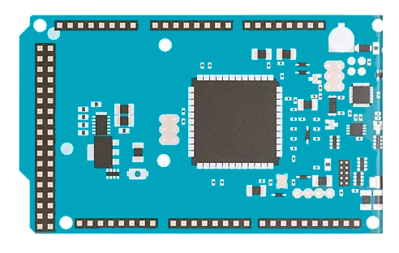

 

  <strong>Neural Speech</strong>

  

  Voice recognition on Arduino Due – ECE Paris Engineering Project

---

## Audio Processing Pipeline

The audio signal undergoes the following processing steps:

1. **Sampling & Filtering**  
   - Sampled at **32 kHz**  
   - FIR Band-pass filter: **300–3400 Hz**  
   - Stop bands: **0–300 Hz** and **4000–16000 Hz**

  

<strong>RIF Used</strong>

2. **Downsampling**  
   - Reduced to **8 kHz** for lightweight processing on embedded device

3. **Framing & Overlap**  
   - Frame size: **256 samples**  
   - Overlap: **37.5%** (96 samples)

4. **Preprocessing**  
   - **AGC (Automatic Gain Control)**  
   - **FFT** to convert signal to frequency domain

5. **Mel Filterbank & MFCC Extraction**  
   - Apply **Mel filters**  
   - Logarithmic compression  
   - Discrete Cosine Transform (DCT)  
   - Extract **12 MFCCs per frame**

  
  

<strong>Mel Filter Application (left) & DCT Matrix Application (right)</strong>

6. **Temporal Context**  
   - Process repeated for **50 frames** = **1 second of audio**  
   - Final MFCC matrix shape: **[50 × 12]**

---

## Deep Learning for Classification

After computing the MFCC matrix, it is passed into a lightweight CNN for binary classification.

### Model Architecture

- **Input:** `(50, 12, 1)` MFCC matrix  
- **Conv2D (8 filters, 3×3)** + **ReLU**  
- **MaxPooling2D (2×2)**  
- **Conv2D (8 filters, 3×3)** + **ReLU**  
- **MaxPooling2D (2×2)**  
- **Flatten**  
- **Dense (8 units, ReLU)**  
- **Dense (1 unit, Sigmoid)** → Binary output

  

<strong>My CNN Model</strong>

The CNN detects local patterns in the MFCC matrix and classifies 1s audio segments.  
The processing is **real-time**: ~1.5s for recording, processing, and prediction.

---

## Deep Learning for Classification

One second after clicked the button, the green LED turns on. While It's on It means you can speak. You have one second to speak. 

Please note that the dataset has been made with just one voice so can't work with other voices. You must update the dataset and train the model again on the new one.

### Hardware Architecture

- **Arduino Due**  
- **Microphone MAX9814**  (A0)
- **LEDs** (Yellow D5, White D3, Green D2)  
- **Push Button**  (D4)

  

<strong>Hardware Shema</strong>

---

## Built With

- [PlatformIO](https://platformio.org/)
- [Arduino Due](https://docs.arduino.cc/hardware/due/)
- [Python 3.7](https://www.python.org/downloads/release/python-370/)
- [Tensorflow 2.2](https://www.tensorflow.org/install?hl=fr)
- [EloquentTinyML](https://github.com/eloquentarduino/EloquentTinyML)
- [ArduinoFFT](https://github.com/kosme/arduinoFFT)

---

## 📫 Contact

Gabriel GUIET-DUPRE  
  
📧 gabriel.guietdupre@edu.ece.fr

[🔗 Project Link](https://github.com/Gab404/NeuralSpeech)
